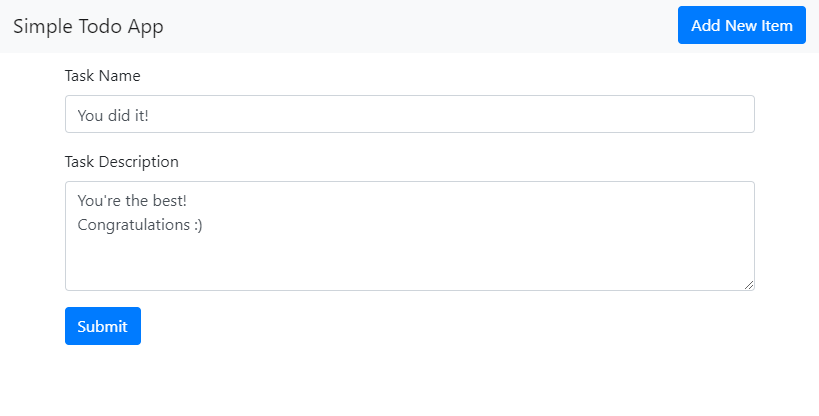

# Flask Part 4 -  Viewing and Updating the Data

## Learning Outcomes

* Use SQLAlchemy to manage and query individual items as well as update them 
* Learn to refactor Jinja2 template files to reduce redundency
* Handle multiple HTTP-Methods in the same route

### Viewing Individual Tasks and Updating Them

An important aspect of managing data, is viewing additional details and updating them. 
We will explore this in the following section where we will create an additional page.

#### Templating Refactoring

When our web application becomes larger and we will inevitably have multiple pages. There are often common components across web pages, particularly a header, footer, navigation bar and other components. If we change the look or feel or the website, we may have to replicate this across all the pages. As you may imagine, if you had 10 different pages, and you changed the navigation bar, you don't want to apply the same change to all of them. 

Thankfully, Flask and Jinja has a good way for us to do this with its templating engine.

First let's create a new file `view_task.html` in the `/templates` folder.

```html


    <div class="container">
        <form action="/task/{{taskId}}" method="post">
            <input name="taskId" type="text" class="form-control d-none" id="inputId" value="{{taskId}}">
            <div class="form-group">
              <label for="inputName">Task Name</label>
              <input name="taskName" type="text" class="form-control" id="inputName" value="{{taskName}}">
            </div>
            <div class="form-group">
                <label for="taskDescription">Task Description</label>
                <textarea name="taskDescription" class="form-control" id="taskDescription" rows="4">{{taskDescription}}</textarea>
              </div>
            <button type="submit" class="btn btn-primary">Submit</button>
          </form>
    </div>
	

```

Let's move the modals into a separate file and call it `modals.html`, and delete it from index.html

```html
<div
  class="modal fade"
  id="newItemModal"
  data-backdrop="static"
  tabindex="-1"
  role="dialog"
  aria-labelledby="newItemModalLabel"
  aria-hidden="true"
>
  <div class="modal-dialog" role="document">
    <div class="modal-content">
      <div class="modal-header">
        <h5 class="modal-title" id="newItemModalLabel">Add New Item</h5>
        <button
          type="button"
          class="close"
          data-dismiss="modal"
          aria-label="Close"
        >
          <span aria-hidden="true">&times;</span>
        </button>
      </div>
      <div class="modal-body">
        <form action="/task/" method="post">
          <div class="form-group">
            <label for="itemName">Task Name</label>
            <input
              name="taskName"
              type="text"
              class="form-control"
              id="taskName"
              placeholder="Item Name"
            />
          </div>
          <div class="form-group">
            <label for="itemDescription">Task Description</label>
            <textarea
              name="taskDescription"
              class="form-control"
              id="taskDescription"
              rows="3"
            ></textarea>
          </div>
          <button type="submit" class="btn btn-primary">Submit</button>
        </form>
      </div>
    </div>
  </div>
</div>

<!-- Modal for Deleting a Task -->
<div
  class="modal fade"
  id="deleteModal"
  tabindex="-1"
  role="dialog"
  aria-labelledby="exampleModalLabel"
  aria-hidden="true"
>
  <div class="modal-dialog">
    <div class="modal-content">
      <div class="modal-header">
        <h5 class="modal-title" id="deleteModalLabel">Are you sure?</h5>
        <button
          type="button"
          class="close"
          data-dismiss="modal"
          aria-label="Close"
        >
          <span aria-hidden="true">&times;</span>
        </button>
      </div>
      <div class="modal-body">
        Are you sure you want to delete this task?
      </div>
      <div class="modal-footer">
        <button type="button" class="btn btn-secondary" data-dismiss="modal">
          Cancel
        </button>
        <button
          type="button"
          class="btn btn-danger"
          onClick="deleteTask(deleteId)"
        >
          Delete
        </button>
      </div>
    </div>
  </div>
</div>
```

Next, create `base.html`.  This will be what all the pages will inherit from, with elements such as the Bootstrap styling, header, navbar and footer.

```html
<!DOCTYPE html>
<html lang="en">
  <head>
    <!-- Bootstrap -->
    <link
      rel="stylesheet"
      href="https://stackpath.bootstrapcdn.com/bootstrap/4.5.0/css/bootstrap.min.css"
      integrity="sha384-9aIt2nRpC12Uk9gS9baDl411NQApFmC26EwAOH8WgZl5MYYxFfc+NcPb1dKGj7Sk"
      crossorigin="anonymous"
    />
    <meta charset="UTF-8" />
    <meta name="viewport" content="width=device-width, initial-scale=1.0" />
    <title>{{title}}</title>
  </head>
  <body>
    <nav class="navbar navbar-light bg-light">
      <a class="navbar-brand" href="/">Simple Todo App</a>
      <button
        type="button"
        class="btn btn-primary"
        data-toggle="modal"
        data-target="#newItemModal"
      >
        Add New Item
      </button>
    </nav>

    <div class="container">
        

        
    </div>

    <!-- Javascript support for bootstrap -->
    <script
      src="https://code.jquery.com/jquery-3.4.1.slim.min.js"
      integrity="sha384-J6qa4849blE2+poT4WnyKhv5vZF5SrPo0iEjwBvKU7imGFAV0wwj1yYfoRSJoZ+n"
      crossorigin="anonymous"
    ></script>
    <script
      src="https://cdn.jsdelivr.net/npm/popper.js@1.16.0/dist/umd/popper.min.js"
      integrity="sha384-Q6E9RHvbIyZFJoft+2mJbHaEWldlvI9IOYy5n3zV9zzTtmI3UksdQRVvoxMfooAo"
      crossorigin="anonymous"
    ></script>
    <script
      src="https://stackpath.bootstrapcdn.com/bootstrap/4.4.1/js/bootstrap.min.js"
      integrity="sha384-wfSDF2E50Y2D1uUdj0O3uMBJnjuUD4Ih7YwaYd1iqfktj0Uod8GCExl3Og8ifwB6"
      crossorigin="anonymous"
    ></script>

    <script>
      var deleteId = 0;
      function setDeleteId(event) {
        deleteId = event.dataset.itemId;
      }
      function deleteTask(id) {
        console.log(deleteId);
        fetch("/task/" + id, {
          method: "DELETE",
        })
          .then(() => window.location.reload())
          .catch((error) => console.log("Something went wrong: " + error));
      }
    </script>
  </body>
</html>
```

`index.html`

```html
 


<table class="table table-striped">
  <thead>
    <tr>
      <th scope="col">#</th>
      <th scope="col">Task</th>
      <th scope="col">Actions</th>
    </tr>
  </thead>
  <tbody>
    
    <tr>
      <th scope="row">{{loop.index}}</th>
      <td>{{task.name}}</td>
      <td>
        <a href="/task/{{task.id}}"
          ><button type="button" class="btn btn-primary">View</button></a
        >
        <button
          type="button"
          data-item-id="{{task.id}}"
          data-toggle="modal"
          data-target="#deleteModal"
          class="btn btn-danger"
          onclick="{setDeleteId(this)}"
        >
          Delete
        </button>
      </td>
    </tr>
    
  </tbody>
</table>
 

```

The final step is to add this functionality to flask.

```python
# GET / UPDATE ID
@app.route('/task/<int:id>', methods=['GET', 'POST'])
def view_task(id):
    if (request.method == "GET"):
        task = Task.query.filter_by(id=id).first()
        return render_template('view_task.html', taskName=task.name, taskDescription=task.description, taskId=task.id)
    elif (request.method == "POST"):
        taskId = request.form.get('taskId')
        taskName = request.form.get('taskName')
        taskDescription = request.form.get('taskDescription')

        task = Task.query.filter_by(id=id).first()
        if (task != None):
            task.name = taskName
            task.description = taskDescription
            db.session.add(task)
            db.session.commit()
        return redirect(url_for('index'))
```

Congratulations, you have developed a complete web application that can manage data on a database with operations such as CRUD (Create, Read, Update, Delete) and have learnt a great deal about routing, templating and Flask in general!



Our next step is to move this to deploy this application to the cloud.

